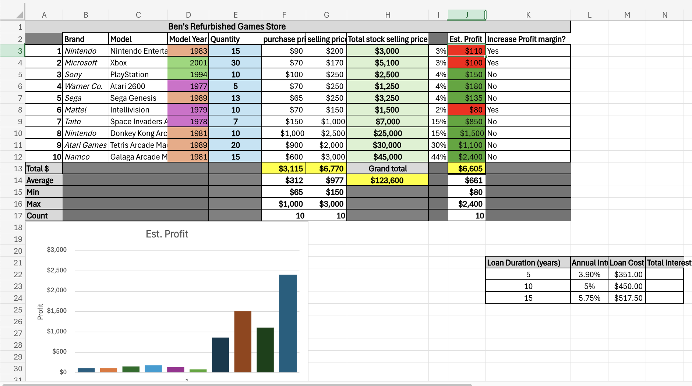

# Ben Turner

### About Me
I am a 3rd-year writing major at Loyola University Maryland, currently interested in becoming an author. I love writing fiction. Video games, and movies are my primary sources of inspiration, though, rather than literature. In my free time, I love listening to music.

### Education
**BSc in Writing**  
Loyola University Maryland

### Projects

#### Project 1: Week 7 Module 9 Assessment 9 - "What Am I Studying?" (Python)
- 
- 
- 
- For the first project, the research question given was “What am I studying?” To answer this question, I first wrote in pseudocode the specific layout of the intended final product. Next, I created a flowchart to visualize the sequence of coding events. Lastly, I used several Python print statements to display all 5 of my classes this semester, along with my name and the course’s title _(CS 105-02 Making Sense of Data)_. The result of this project taught me the skill of basic Python print statements, as well as a solid understanding of pseudocode and Python flowcharts.

***
#### Project 2: Week 5 Module 7 Assessment 7 - Inventory Management Continued (Excel)
- 
- For my second project, I was tasked with continuing the creation of an inventory management Excel spreadsheet by incorporating an embedded object that serves as a single visual representation of the spreadsheet’s data. Though I had little trouble with this assignment, it led to a deeper understanding of spreadsheet automation and the creation of linked tables.

***
#### Project 3: Week 12 Module 15 Assessment 15 - Student Transcripts (Access)
- 
- 
- This final project asked me to create a Microsoft Access database that serves as a list of fake students’ transcripts. With the assignment’s focus being on two of the ten total fabricated students, I had to create a query from the data tables I had made to find the two specific students (Ben Turner and Velma Strange). At first, I struggled with this task, as linking two separate databases confused me at first, however, I realized that I simply had to link like variables to one another for the outcome to be correct. This project taught me the skill of Access database linking and query mastery.
